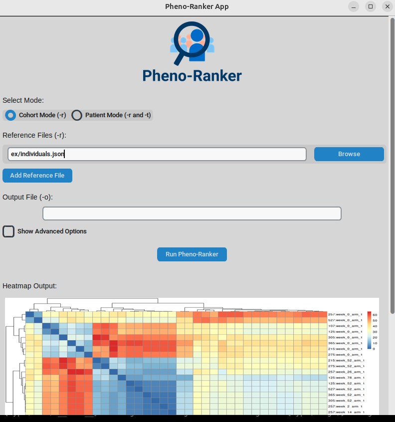

# Pheno-Ranker App

A standalone desktop application for phenotype ranking using the Pheno-Ranker tool, built with Python and CustomTkinter.

## Overview

**Pheno-Ranker App** is a desktop application that provides a user-friendly graphical interface for the Pheno-Ranker tool. Designed for researchers and clinicians in genetics and bioinformatics, it simplifies phenotype ranking by offering an intuitive interface to input data, configure options, and visualize results.

This application is built with Python and utilizes the [CustomTkinter](https://github.com/TomSchimansky/CustomTkinter) library for an enhanced GUI experience. It integrates the **Pheno::Ranker** Perl module from CPAN, ensuring robust and reliable phenotype analysis.

## Features

- **User-Friendly Interface**: Simplifies phenotype ranking with an intuitive GUI.
- **Multiple Modes**:
  - **Cohort Mode**: Analyze multiple reference phenotype files.
  - **Patient Mode**: Compare a target phenotype file against reference files.
- **Dynamic Input Handling**: Easily add multiple reference files.
- **Advanced Options**: Access and configure advanced settings for customized analyses.
- **Visualization**:
  - Generates heatmaps and displays them within the application.
  - Supports dynamic resizing and updating of visual outputs.
- **Error Handling**: Enhanced validation and error messages to guide users.
- **Integration with Pheno::Ranker**: Leverages the powerful Pheno::Ranker Perl module for analysis.

## Snapshot



## Getting Started

### Prerequisites

- **Docker**: Ensure you have [Docker](https://www.docker.com/get-started) installed on your system.

### Installation and Running the Application

#### Option 1: Pull from Docker Hub

The prebuilt Docker image is available on Docker Hub and can be pulled and run directly:

```bash
   docker pull manuelrueda/pheno-ranker-app
```

#### Option 2: Build the Docker Image locally

If you prefer to build the Docker image yourself, a Dockerfile is provided.

Download the Dockerfile:

```bash
wget https://raw.githubusercontent.com/mrueda/pheno-ranker-app/refs/heads/main/Dockerfile
```

Build the Docker Image:

```bash
wget https://raw.githubusercontent.com/mrueda/pheno-ranker-app/refs/heads/main/Dockerfile
docker build -t pheno-ranker-app .
```

#### Run the Docker Container

We need X11 access to be able to display windows.

```bash
xhost +local:docker
docker run -it --rm \
    -e DISPLAY=$DISPLAY \
    -v /tmp/.X11-unix:/tmp/.X11-unix \
    pheno-ranker-app
xhost -local:docker
```
